# Sandboxing

## Introducción

El sandboxing es una técnica de seguridad que permite ejecutar aplicaciones en un entorno aislado del sistema principal. Su objetivo es analizar y probar programas sin poner en riesgo el equipo anfitrión.

## ¿Qué es el Sandboxing?

Sandboxing consiste en crear un espacio controlado donde una aplicación se ejecuta con permisos limitados, sin acceso completo al sistema de archivos ni a la red, evitando que posibles acciones maliciosas afecten al sistema real.

## Ventajas

- Aislamiento de procesos
- Reducción de riesgos de seguridad
- Control de acceso a recursos
- Posibilidad de analizar malware sin comprometer el sistema
- Facilidad para probar aplicaciones desconocidas

## Beneficios de utilizarlo

- Mayor protección del sistema operativo
- Seguridad al ejecutar código de terceros
- Entorno seguro para aprendizaje y pruebas
- Mejora en la confianza al desplegar aplicaciones

## Instalación de Firejail y Firetools

Primero actualizamos los paquetes e instalamos las herramientas necesarias:

```bash
sudo apt update
sudo apt install firejail firetools -y
```

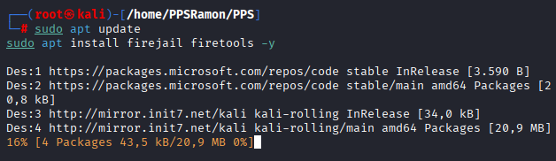

## Ejecución con Firejail

# 1. Configuración inicial
Copiar el codigo de ejecucion de terminal root, editando la aplicación y el apartado que pone “Orden”.

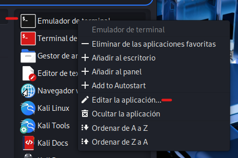

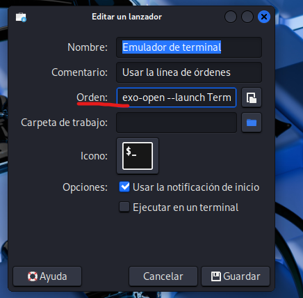


# 2. Abrir el asistente de configuración
Abrir Firejail Configuration Wizard:

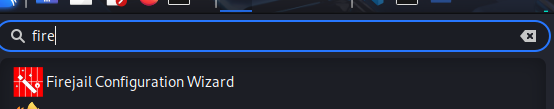

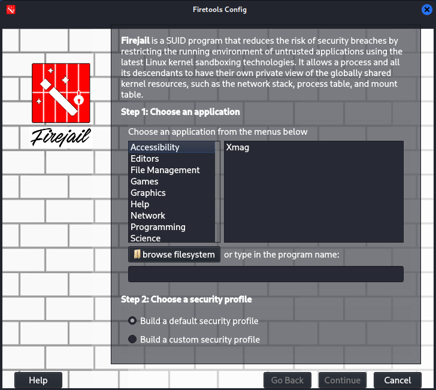

# 3. Insertar el comando
Pegar el código de ejecución anterior en la zona donde está el cuadro de texto:

```bash
exo-open --launch TerminalEmulator
```

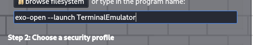

# 4. Continuar y finalizar
Pulsar Continue.


Finalmente, seleccionar “Done”.


# 5. Terminal
Se abrirá un terminal dentro del entorno aislado:

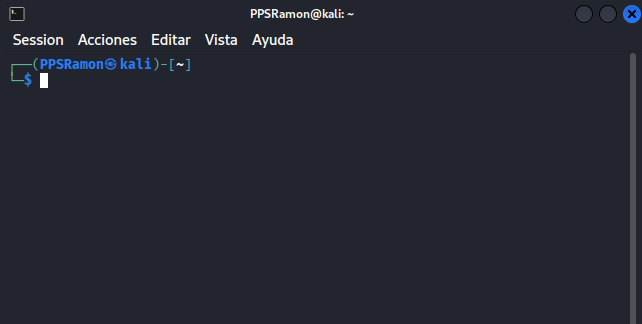

# 6. Verificación con Firetools
Abrir FireTools y seleccionar la segunda opción para comprobar que se está ejecutando correctamente:

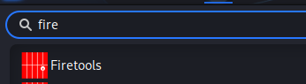
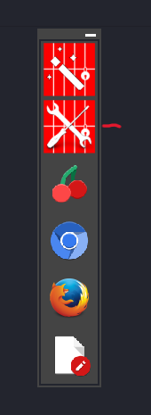

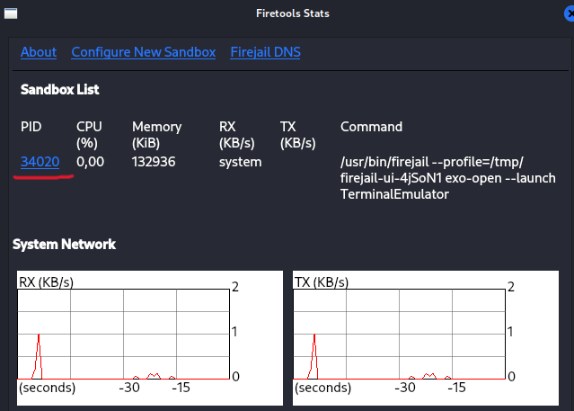

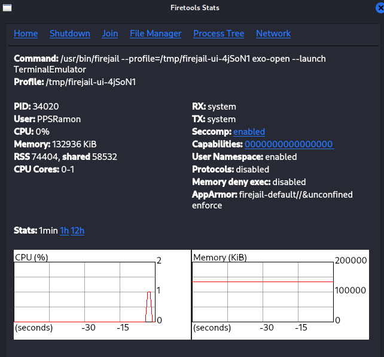

# 7. Ejecutar la aplicación Python
Ir a la ruta del ejecutable y ejecutar el programa en Python dentro del sandbox:

```bash
python3 main.py
```

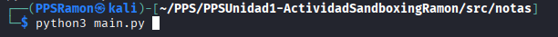
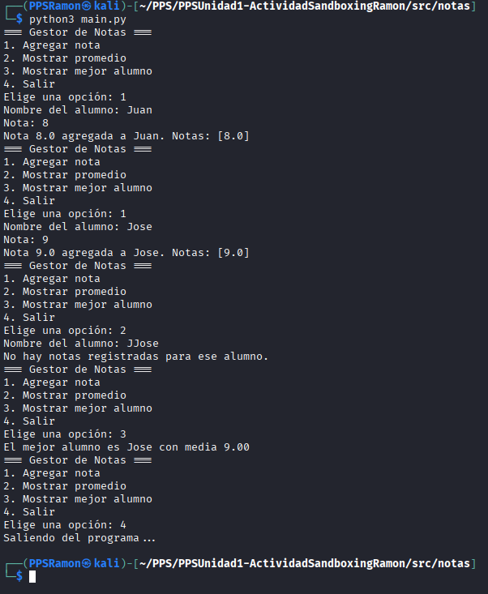


## Ejecución sin Firejail
Para comparar, ejecutamos la aplicación directamente en el sistema, sin aislamiento:

```bash
python3 main.py
```

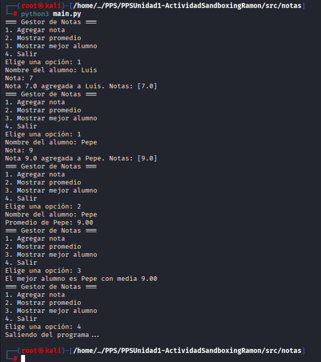

## Conclusión

El uso de sandboxing aporta una capa adicional de seguridad y control. Permite ejecutar aplicaciones de forma segura, comparar su comportamiento con y sin aislamiento, y comprender mejor cómo proteger un sistema frente a posibles amenazas.